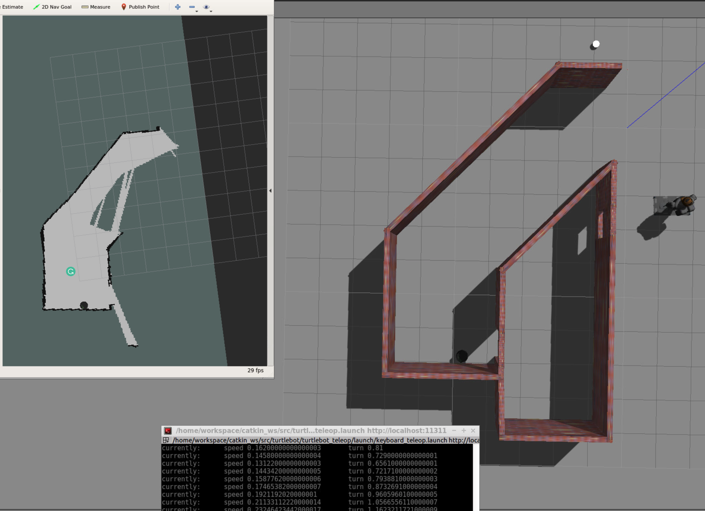
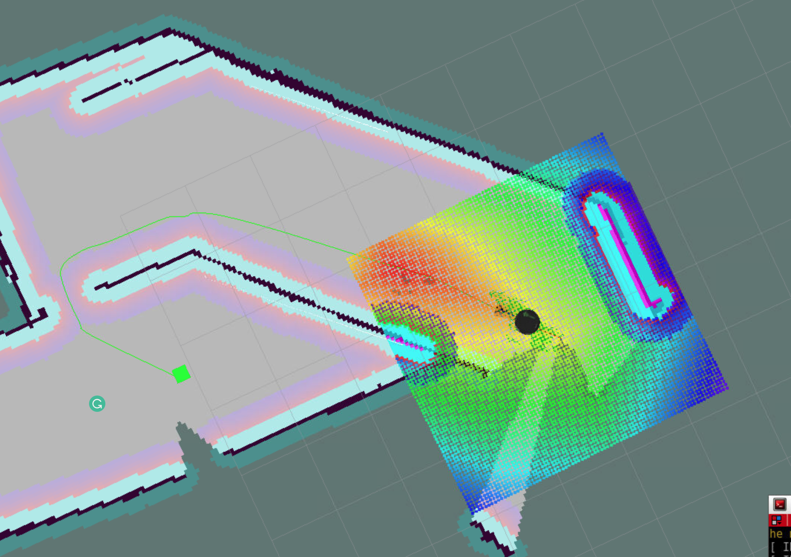

# RoboNd-Home Service Robot
Robotics Engineer Nanodegree Program

---
## Basic Build Instructions
Create catkin workspace

mkdir -p catkin_ws/src

cd catkin_ws/src

catkin_init_workspace

clone this repo with the --recursive option, because dependencies are loaded as submodules

git clone --recursive https://github.com/mlopezfu/RoboNd-HomeService.git

cd ..

catkin_make

source devel/setup.bash

There ROS packages are in the repo, but they are from ROS and can be installed from their original source.

gmapping: With the gmapping_demo.launch file, you can easily perform SLAM and build a map of the environment with a robot equipped with laser range finder sensors or RGB-D cameras.
turtlebot_teleop: With the keyboard_teleop.launch file, you can manually control a robot using keyboard commands.
turtlebot_rviz_launchers: With the view_navigation.launch file, you can load a preconfigured rviz workspace. You’ll save a lot of time by launching this file, because it will automatically load the robot model, trajectories, and map for you.
turtlebot_gazebo: With the turtlebot_world.launch you can deploy a turtlebot in a gazebo environment by linking the world file to it.

This repo has the followinf folder structure:

    ├──                                # Official ROS packages
    |
    ├── slam_gmapping                  # gmapping_demo.launch file                   
    │   ├── gmapping
    │   ├── ...
    ├── turtlebot                      # keyboard_teleop.launch file
    │   ├── turtlebot_teleop
    │   ├── ...
    ├── turtlebot_interactions         # view_navigation.launch file      
    │   ├── turtlebot_rviz_launchers
    │   ├── ...
    ├── turtlebot_simulator            # turtlebot_world.launch file 
    │   ├── turtlebot_gazebo
    │   ├── ...
    ├──                                # Your packages and direcotries
    |
    ├── map                          # map files
    │   ├── ...
    ├── scripts                   # shell scripts files
    │   ├── ...
    ├──rvizConfig                      # rviz configuration files
    │   ├── ...
    ├──pick_objects                    # pick_objects C++ node
    │   ├── src/pick_objects.cpp
    │   ├── ...
    ├──add_markers                     # add_marker C++ node
    │   ├── src/add_markers.cpp
    │   ├── ...
    └──
    

## Basic Instructions
The project is launched via shell scripts that are stored in the script folder. 

The content on this folder need execution permisssion, so from catkin_ws the following command can be launched

chmod 777 ./src/script/*

After that, any script can be launched

# SLAM Testing
From catkin_ws run project with command:

./src/script/test_slam.sh

This will launch:
- world
- rviz
- gmapping
- teleop

teleop, will move robot with these commands.
<pre>Reading from the keyboard  and Publishing to Twist!
---------------------------
Moving around:
   u    i    o
   j    k    l
   m    ,    .

q/z : increase/decrease max speeds by 10%
w/x : increase/decrease only linear speed by 10%
e/c : increase/decrease only angular speed by 10%
anything else : stop

CTRL-C to quit</pre>

If you move the robot you can see the map on rviz. After the map is complete, in another terminal, the map can be saved with the following command:

rosrun map_server map_saver -f <your map name>

# Navigation Testing
From catkin_ws run project with command:

./src/script/test_navigation.sh

This will launch:
- world
- rviz
- gmapping

This will open the world and rviz with the map generated in the previous step. Some goal can be defined via rviz and robot will go to goal.
  

 
# Pick object
From catkin_ws run project with command:

./src/script/pick_objects.sh

This will launch:
- world
- rviz
- localization
- pick object node

and will publish 2 markers
  
The robot will try to reach the marker.
  
If you want to visualize the marker must add it manually to Rviz
  
# Add marker
From catkin_ws run project with command:

./src/script/add_marker.sh

This will launch:
- world
- rviz
- localization
- add marker node

This node will:
  
- Publish the marker at the pickup zone
- Pause 5 seconds
- Hide the marker
- Pause 5 seconds
- Publish the marker at the drop off zone

# Home Service
From catkin_ws run project with command:

./src/script/home_service.sh

This will launch:
- world
- rviz
- localization
- add marker node
- pick object node

This node will combine the 2 last nodes, so, a marker will be published, the robot will go for it, and after the goal is reached the marker will go to drag zone, so robot will go to drop zone.
  

